# Changelog

Changes to the game itself, newest first, with the time each went live (Honolulu time, from the commit history). Save commits (`Day NNN ...`) are the adventure log and aren't listed here.

## v0.49 - Oct 8 2026, 01:10 HST

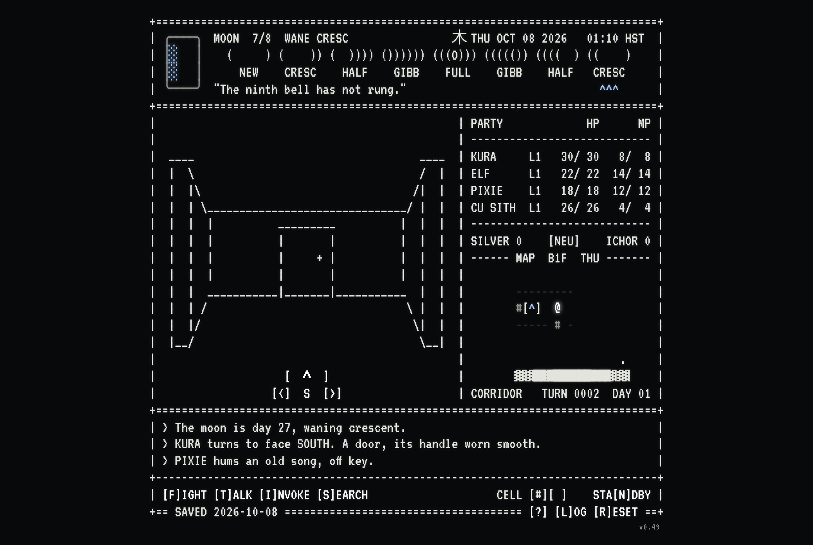

Doors that wait for you, slower searching, and a health bar for KURA.

- **Doors:** unlocking a door only opens it. KURA stays where she is and walks in when you choose.
- **Searching:** finds take more work, and a wall gets stingier after it gives something up.
- **Minimap:** open doorways are plain gaps, and a locked door's `#` is never covered by the facing arrow.
- **Fight popup:** KURA has a health bar like the enemy's. The text keeps to two lines and rolls up. `[D]ISCHARGE` is gone from fights for now.
- **Demons:** a little more patient with silence.
- **Cheat menu:** `X` shows three left-aligned lines, and the build number sits right under the screen.
- **Changelog:** older entries are vaguer.

## v0.48.1 - Oct 8 2026, 00:24 HST

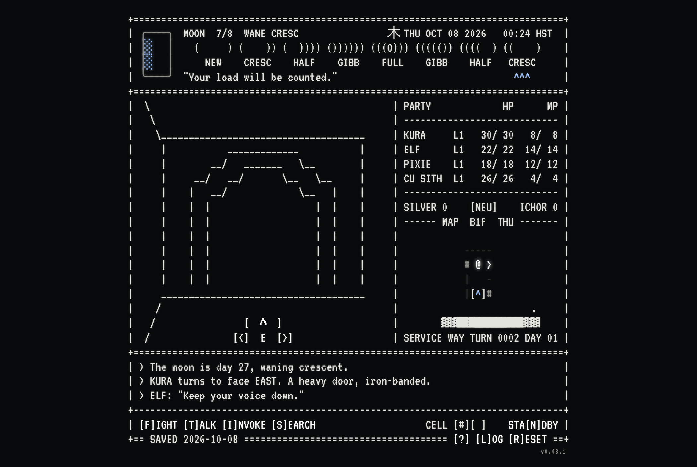

A new name, and gentler demons.

- **Name:** the game is now called Daily Digital Demon Dungeon.
- **Talking:** demons are a little more patient with silence.

## v0.48 - Oct 8 2026, 00:14 HST

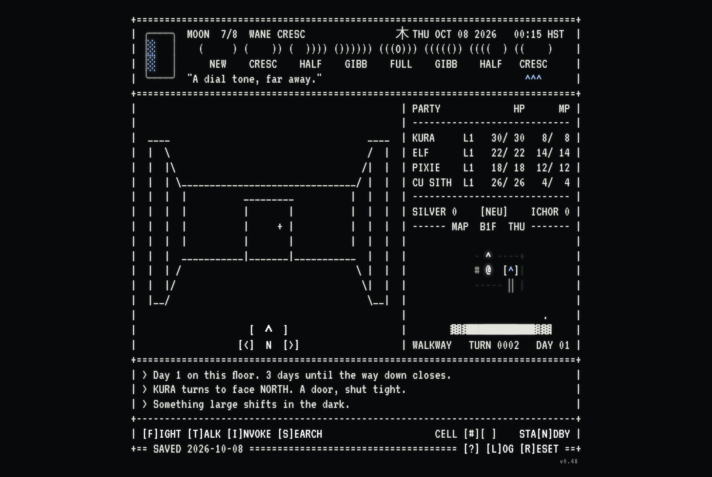

Room names, and some tidying.

- **Room names:** the bottom row of the side panel now shows the name of the room you are in, before TURN and DAY. The first room is STAIRS UP; names are flavor only.
- **Cell:** the cell indicator is two slots, `CELL [#][ ]`, so an empty cell is visible.
- **Party talk:** a party member's reply on log line 3 clears when you take your next action.

## v0.47 - Oct 7 2026, 23:51 HST

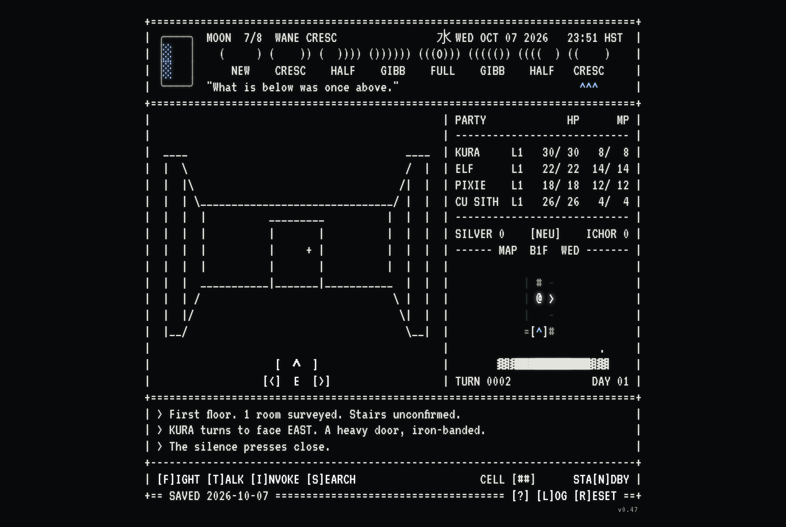

Talking, programs, corrupted demons, and rooms that describe themselves.

- **Demon talk:** a demon asks for a gift only some of the time; otherwise the talk ends peacefully or it offers to join. Questions have a third answer, `[S]ILENT`. Every demon has a personality that shapes how it reacts. Answers about order or mischief pull toward LAW or CHAOS, and recruits are kept as pacts (listed in the run summary).
- **Party talk:** party questions have `[S]ILENT` too, with the three buttons on log line 3. Members share the personalities. One almost out of patience asks "Anything else you want to say?" A member at ease sometimes confides something, once each, in order.
- **Friendly programs:** a few pieces of software in the dungeon's system can be recruited, each with a small job. They are listed in the Codex.
- **Corrupted demons:** some demons turn up corrupted, with a glitched name. Talking can restore them.
- **Rooms:** entering a room shows flavor only. Searching a locked door says it is one, and searching an arch says what the room beyond is like.

## v0.46.1 - Oct 7 2026, 23:21 HST

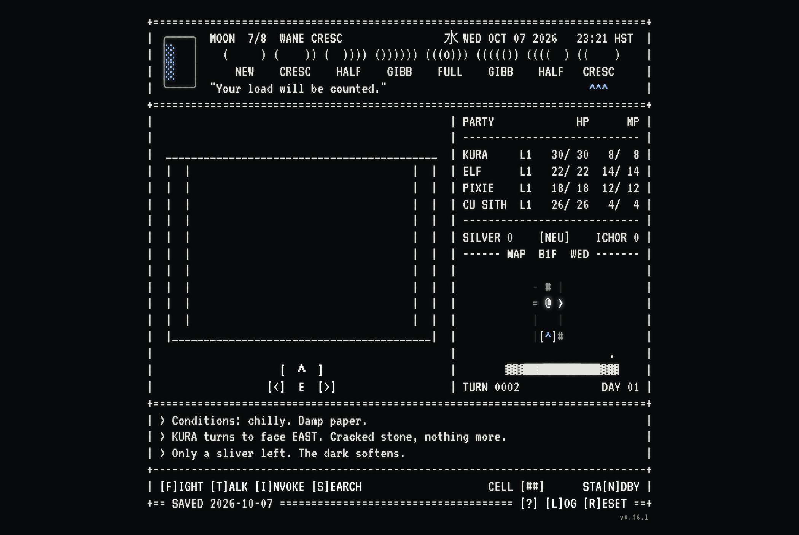

Alignment between SILVER and ICHOR, and questions answered beside the question.

- **Alignment tag:** `[NEU]` now sits between SILVER and ICHOR (`< [LAW]` or `[CHA] >` when the last action pulled that way). It tightens to `<[LAW]` when the amounts are big and drops out when there is no room. The bottom row keeps just TURN and DAY.
- **Questions:** `[Y]ES   [N]O` sit at the right end of log line 3, beside the question, instead of in the bottom bar. STA[N]DBY stays put.

## v0.46 - Oct 7 2026, 23:19 HST

Fight popups get art space, a clearer cell, and a party exit that always says so.

- **Fight popups:** "APPEARS" and "THE WAY IS CLEAR" keep the same art frame the fight box has.
- **Cell:** `CELL [##]` when charged and `CELL [  ]` when spent, so the spare `[+]` stays put.
- **A party member leaving** now always gets its popup, even when a find was already open (it waits its turn).

## v0.45 - Oct 7 2026, 23:09 HST

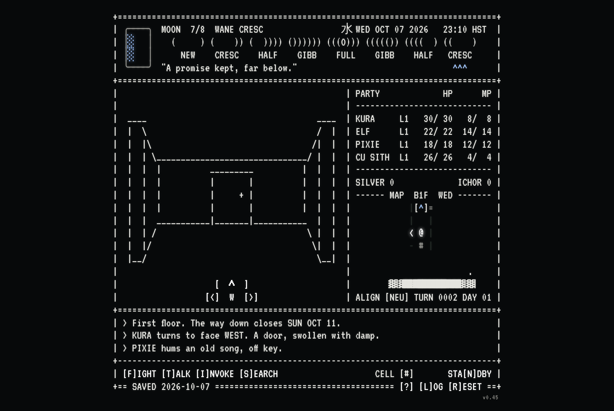

The spare cell on screen and a cleaner minimap.

- **Spare cell:** the bottom bar shows `CELL [#]` (ready) or `CELL [ ]` (spent), with `[+]` when a spare is banked.
- **Minimap:** side walls are no longer clipped at the window edge, doors inside one wing are plain gaps, and a passage cell is blank (just `@`, `^` or `v` when you stand in it).
- **Questions:** `[Y]ES` and `[N]O` no longer glow or change color, line up with the bar, and flash twice.
- The help page calls it `[P]ASSWORD`.

## v0.44 - Oct 7 2026, 22:34 HST

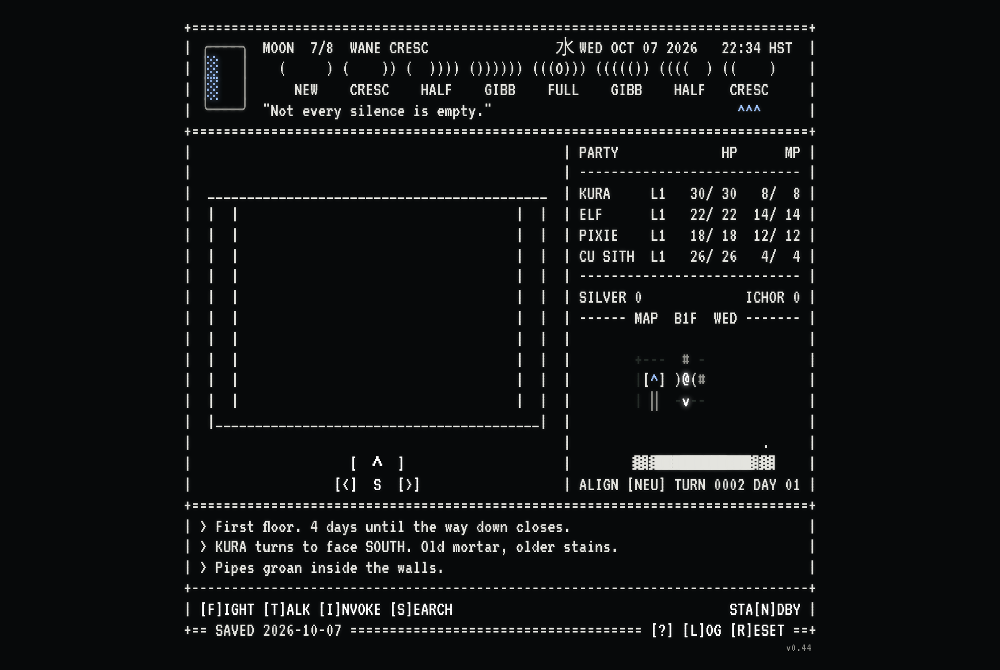

A longer week, charge instead of keys, camp, discharge, drops, and the open-door arch.

- **The week:** a floor now lasts the days left in the week.
- **Charge:** the day's key is now a charge in a cell. A day nobody played banks one spare cell (one at most), which can open one more door.
- **Camp:** STANDBY lets the party rest.
- **Discharge:** `[D]ISCHARGE` in a fight spends the day's charge on one powerful blow, after a confirm popup.
- **Demons drop things:** a fallen demon may leave something behind.
- **Open doors are a big double-line arch** with the room left empty. A passage is `) (` on the minimap (`)@(` when you stand in it), and the grid outline is dimmer.
- `[P]ASS` moved to the help page, next to `[C]ODEX`. The log page has a gap under its heading. TURN has four digits and DAY two.

## v0.43 - Oct 7 2026, 21:45 HST

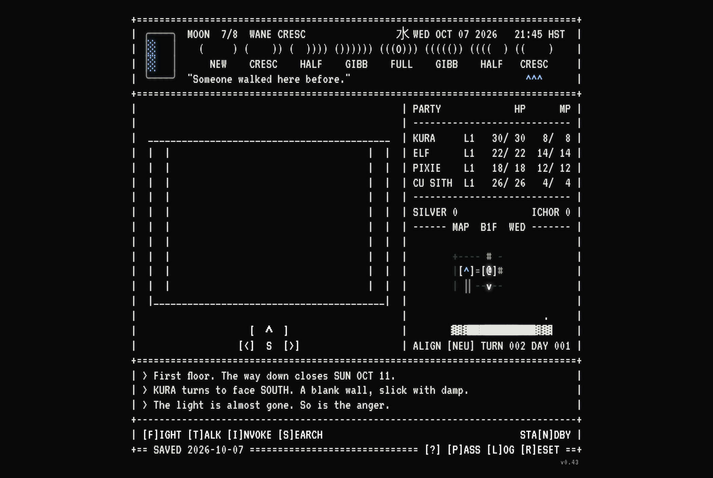

Minimap and door tiles, plus a few fixes.

- **Minimap:** the grid outline is dimmer. Locked doors are `#`, a sealed door is plain wall, a passage is `] [`, and the `[:]` mark is gone. The facing arrow stays.
- **Open doors in the 3D view** show the empty frame with the dark beyond, instead of a knob.
- **A blocked run opens a popup** ("PING blocked your way.") that waits for `[ OK ]`.
- **A new run rerolls the omens.** The invoke result line is plain white, not gold, and STA[N]DBY sits a touch lower.

## v0.42 - Oct 7 2026, 21:23 HST

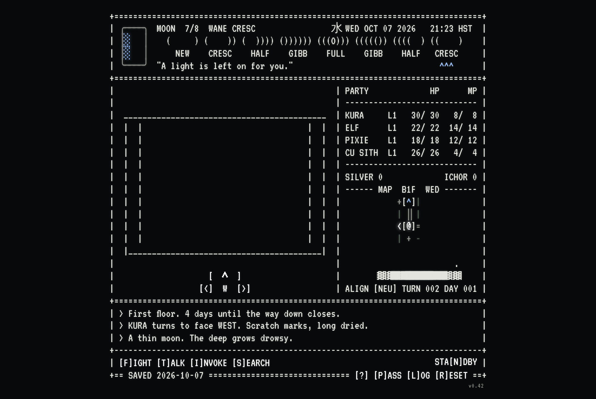

Searching, running, and a tidier top box.

- **Searching takes work.** Finds need repeated searches, and a noise hint ("KURA hears something") replaces the warm-wall line.
- **Running is one attempt per fight.** After it fails, `[R]UN` dims.
- **The omen moved into the moon box**, in quotes, left-justified on the bottom line, next to the `^^^`. Omen lines were shortened to fit.
- **The log page** has the heading on top and the buttons right-aligned below it. `[C]ODEX` is gone from the bottom bar.
- `[  ^  ]` never greys out, the `^` is centered, and STA[N]DBY sits a touch lower.

## v0.41 - Oct 7 2026, 20:59 HST

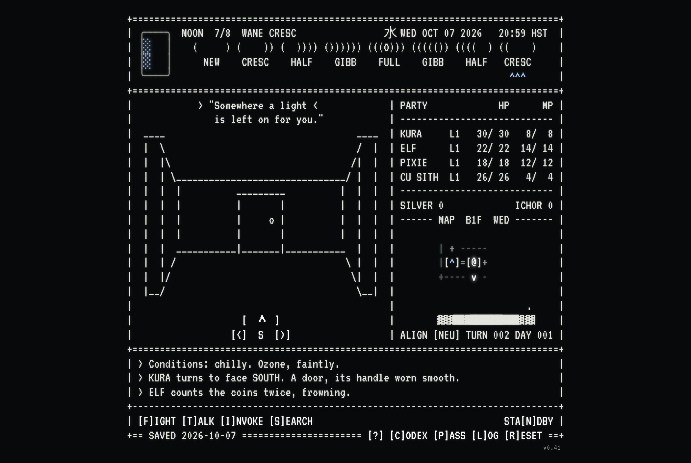

A pass over the code, fixing what a review found, plus a few small changes.

- **A party member leaving opens a popup** (`[ OK ]`), wherever it happens. `[  ^  ]` is two spaces each side with a bigger `^`, and the lines no longer shift on that row.

- **Safer boxes and keys.** In the unlock box only Enter or Y says yes (a compass letter, or a held key, no longer confirms and spends the key); everything else is no. A new box replaces any stale one (so a cancelled standby can't run when you confirm a door). Clicking a field in the password box no longer closes it, buttons behind an open box do nothing, dim buttons do nothing (the step button still searches a wall), and cancelling a question brings back the fight or altar box.
- **New runs start clean.** Reset clears the last run's leftovers. A run that dies at the deadline no longer keeps a live demon or question.
- **Search fixes.** Items are spread over a room's walls properly (the wall picker was stuck on one wall).
- **Saves.** A corrupt or older save is kept aside instead of overwritten; a password must actually run before it can replace your run; a bad frame no longer freezes the screen.
- **Smaller fixes.** A waiting party question survives a reload; YES/NO in the swap stage keeps the text; a question lapses when a demon steps in; demons you already have don't turn up as strangers; wing building finds a layout sooner; the cached `Date` header is corrected for age.
- **Buttons.** `[C]ODEX` and `[P]ASS` are on the bottom bar; popups are marked as dialogs and Tab and F-keys work.
- Dead code removed.

## v0.40 - Oct 7 2026, 19:57 HST

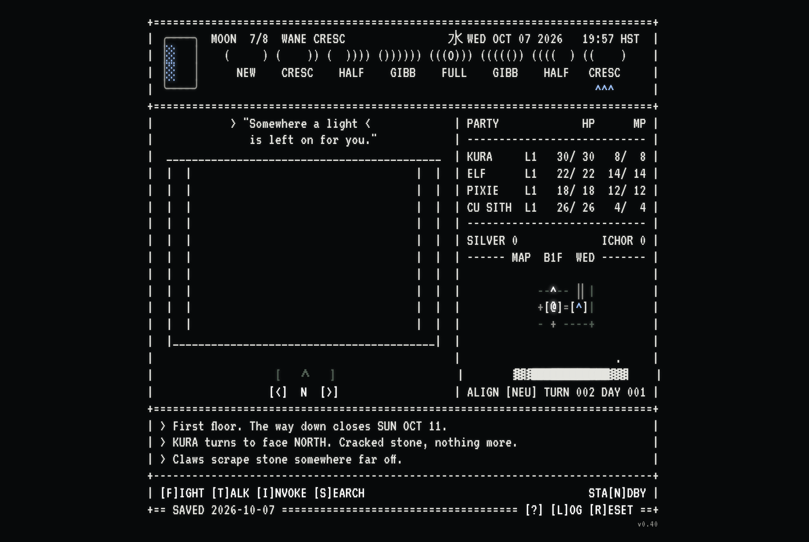

- **The minimap outlines the rooms you've been in** with dim `+ - |` walls (neighbors share a wall). The wall is opened at every door, so a doorway reads `+ ‖ +` and the corners next to it turn into `-` or `|`. Open doors are `=` `‖`, locked or false ones `+`, sealed ones `x`.
- **A new demon says so first.** The fight box opens on `NAME APPEARS` with an `[ OK ]` (ignored for the first moment), so a run of key presses can't charge into the fight unseen.
- **`[   ^   ]`** is a little narrower again, with a bigger `^` (no glow).

## v0.39 - Oct 7 2026, 19:48 HST

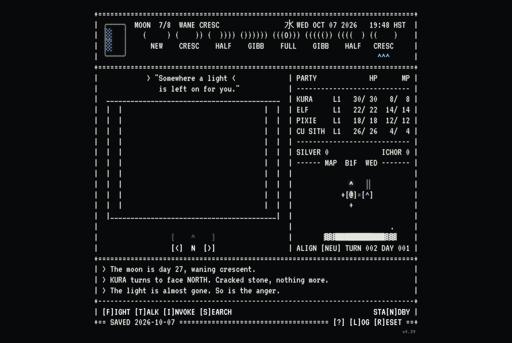

- **Everything asks in the game.** STANDBY, a new run and loading a password are in-game boxes now (no browser dialogs). The password box has `[ COPY ]`, `[ LOAD ]` and `[ CLOSE ]`.
- **Significant events are popups.** A hit, a party member who has had enough, leaves or joins, a new floor, the week ending and warnings open a box that waits for `[ OK ]`, so spamming can't click through them.
- **`[R]UN` is a button in the fight box.** It takes any open way (unlocked doors first), no matter which way KURA faces. In a fight `[<]` `[>]` and `[  ^  ]` are dimmed and do nothing, and the blinking RUN label is gone.
- **Yes/No fixes:** a party member's answer now shows at once instead of the old question staying up. Blinking buttons stay clickable while dark.
- **`[  ^  ]`** is wider (`[    ^    ]`), and facing a bare wall it searches that wall.

## v0.38 - Oct 7 2026, 19:31 HST

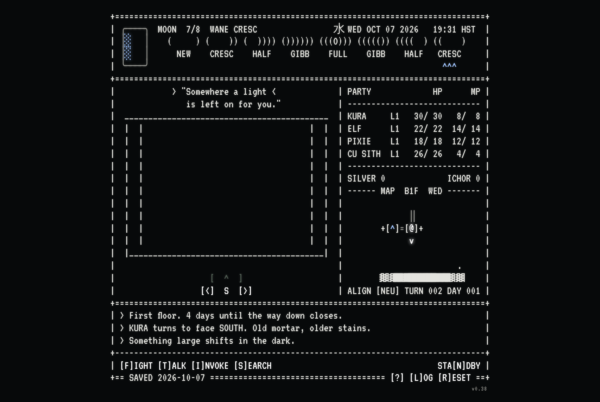

- **`[  ^  ]`** is a new, wider forward button (7 characters, same type size as `[<]` `[>]`, no scaling or glow); RUN moved over to make room.
- **Yes/No in the bar.** A party member's `[Y]ES` / `[N]O` question now sits at the right of the bottom bar (replacing STA[N]DBY) so it never covers the log; searching and moving wait for the answer. Demon questions stay in the fight popup.
- **Items that break get a popup** (`IT BROKE`) and it waits for `[ OK ]`. If something came to see what broke, the fight opens after it.
- **INVOKE:** the `[ENTER] use` row stays at the foot of the bag so it no longer jumps up a line when you use or switch items.
- **Line 1 never says the day** (line 2 already shows it). Item descriptions no longer show an alignment.

## v0.37 - Oct 7 2026, 19:13 HST

- **Floors are built from wings.** A floor is a set of wings you can walk freely, joined by locked doors. Open one door (one key a day) and the other **seals** for good (`x` on the map and the door, dimmed). A wing is built when its door is unlocked. This replaces the random branching map and the hidden path.
- **Clues are the puzzle.** Searching a locked door sometimes gives a faint hint of what's behind it, and scraps of writing hint at the rest.
- **Passages** are now free spaces inside a wing.
- **The stairs** are hidden somewhere on each floor. The old distance clues, the hidden path and the glowing `?` are gone; a visited room still shows `?` while its locker is unfound.
- **Fixes and polish:** the find popup only closes on its `[ OK ]` (Enter or a click); a party member's `[Y]ES`/`[N]O` question waits for an answer; `[^]` matches `[<]` `[>]` (no glow, same size); the fight popup has a blank line under the names; a `[C]ODEX` link sits at the top of the `[?]` page; the help text explains `+` and `x`.
- Runs saved before this change start over.

## v0.36 - Oct 7 2026, 18:45 HST

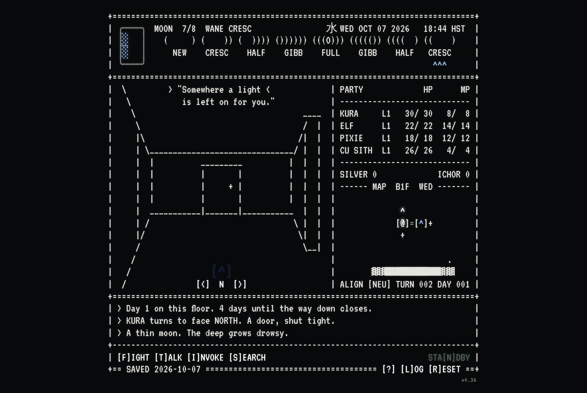

- **One key a day, and a floor that grows.** The day's one move is now one *new door*. Opening a locked door uses the day's key (a popup asks first: "UNLOCK THE EAST DOOR?"); a door that's already open is free, so you can walk back through rooms you've cleared as much as you like. With the key spent, a locked door stays shut. `STA[N]DBY` spends the key and earns the deeper rest, as before.
- **Locked doors show.** On the map an unopened door is a `+`; on the door itself in the 3D view the knob becomes a `+`.
- **A bigger, branching map**, built a door at a time. Nothing past the door exists until it's opened.
- **Fight popup.** The art frame is on top, then the enemy's name and HP bar with `ROUND #` at the right, then `> KURA` and the text, indented in from the edge.
- Runs saved before this change start over (the floors work differently now). Fixed a few lines that were too long for the log.

## v0.35 - Oct 7 2026, 18:03 HST

- **Under the hood:** each room keeps its own record. Nothing about how the game plays changes; it is groundwork for a bigger, branching map. Runs saved the old way convert themselves the first time they load.

## v0.34 - Oct 7 2026, 17:53 HST

- **Rooms have their own character.** Names never show; each does its one thing when you walk in, with its own line.
- **A terminal in the wall.** Face it and `[S]EARCH` or `[G]IVE` to wake it. It types a greeting over a drifting sine wave.
- **`STA[N]DBY`, a third choice for the day** beside going forward and back. It spends the day's step, and the next morning's rest is deeper. A day you just don't step gets nothing extra.
- **The moon strip**: the eight phases as blocks (lit on the right while waxing) on the line above `ALIGN`, with a `.` over today's.
- **`[S]EARCH` works on a door** (and the stairs): it still finds nothing, but it counts as an action, so line 1 changes and line 3 holds.
- `[^]` has no glow. `[P]ASS` moved off the bottom border (the `P` key and the `[?]` help still have it).

## v0.33 - Oct 7 2026, 16:45 HST

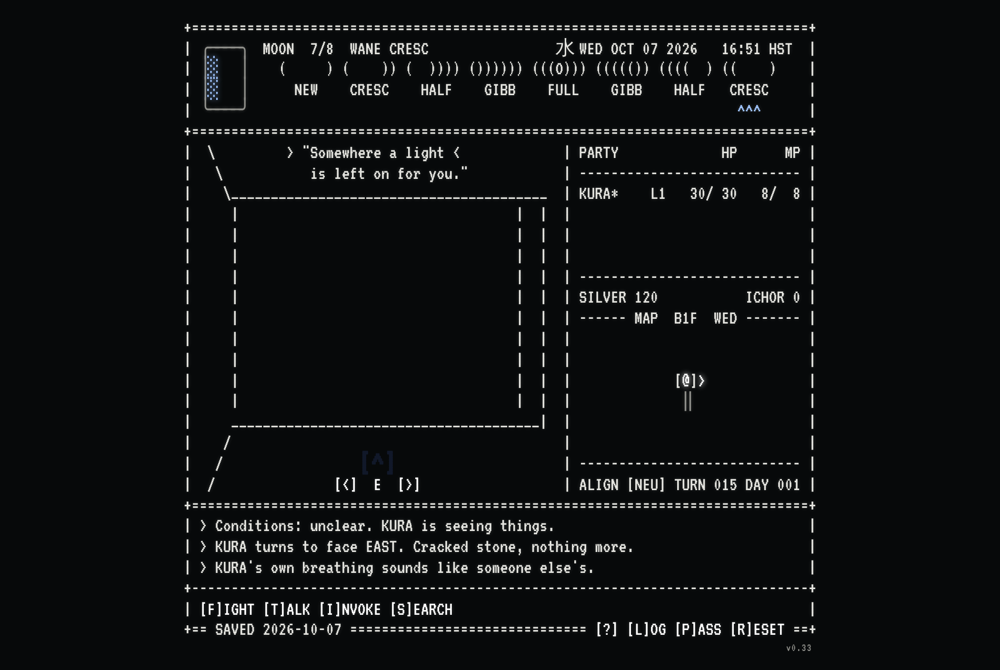

- **Text lines hold for two turns and two seconds.** Line 3 stays on screen until KURA has taken two more actions and two seconds have passed, so fast clicking can't skip past it. Warnings (a demon, damage, a closing way down, game over) still replace it at once.
- **Repeating yourself is tracked in one place now,** for everything you can do. The party gets restless as before.
- **Being alone** in the dark has its own effects. Company keeps it away.

## v0.32 - Oct 7 2026, 16:19 HST

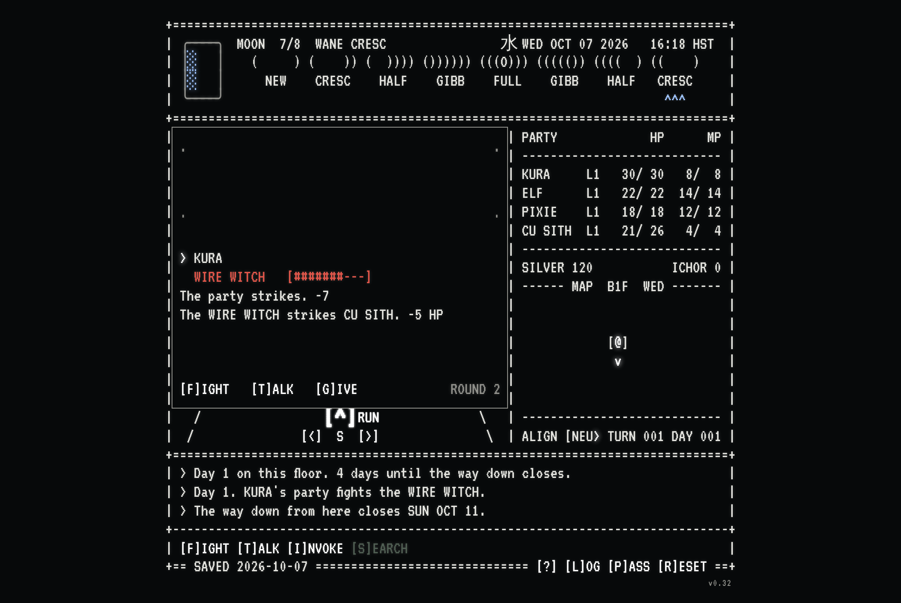

- **The block moon was backwards.** Waxing is now lit on the right and waning on the left, as in the northern sky, so today's waning crescent shows its sliver on the left.
- **The fight box moved into the 3D view**, like the bag, so the party panel and map stay in sight (and `[^] RUN` and the turn buttons stay clickable under it). It has a faint empty slot at the top for art later, a `>` that points at KURA when it's your move and at the demon while its lines play, and `ROUND N` at the right end of the button row. A round plays back one line at a time; click or act to skip it.
- **`[G]IVE` replaces `[I]NVOKE` in the fight box** (`[I]NVOKE` on the bottom menu still opens the bag, and closing it from the menu now brings the fight box back). GIVE opens the gift list straight away, with `[B]ACK` to close it for free. A demon that is already fighting rarely cares. Every family has new voice lines for it.
- The blinking `[^]` and `RUN` glow less.
- VT323 now ships with the game (`fonts/`, with its license), so the page no longer loads anything from Google.

## v0.31 - Oct 7 2026, 15:01 HST

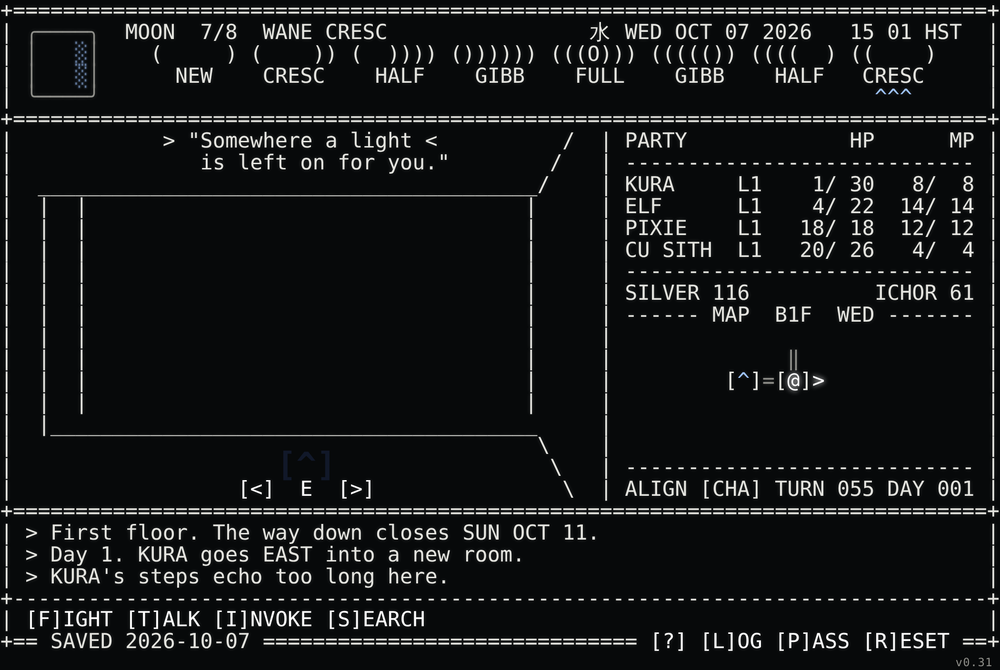

- The README is shorter and punchier: what the game feels like, not how every system works.
- The fight box reads `[F]IGHT [T]ALK [I]NVOKE`: INVOKE opens the bag mid-fight (using something, then back to the fight), and RUN is gone from the box. Running is still the `[^]` step (or the up arrow) through a door.
- The LOG page (and the end-of-run log) has `[D]OWNLOAD`, which saves the log as a text file, and `[COPY]`, which copies it to the clipboard. The text includes the end-of-run stats when the run is over.
- The `[^]` step button glows more softly, and when it's spent (or facing a wall) it dims to a dark blue.
- In a fight, the way out flashes: `[^]` blinks with RUN beside it when KURA faces an open way, and the turn buttons blink when she faces a wall (turn to find a door). Nothing flashes once today's step is spent.

## v0.30 - Oct 6 2026, 20:58 HST

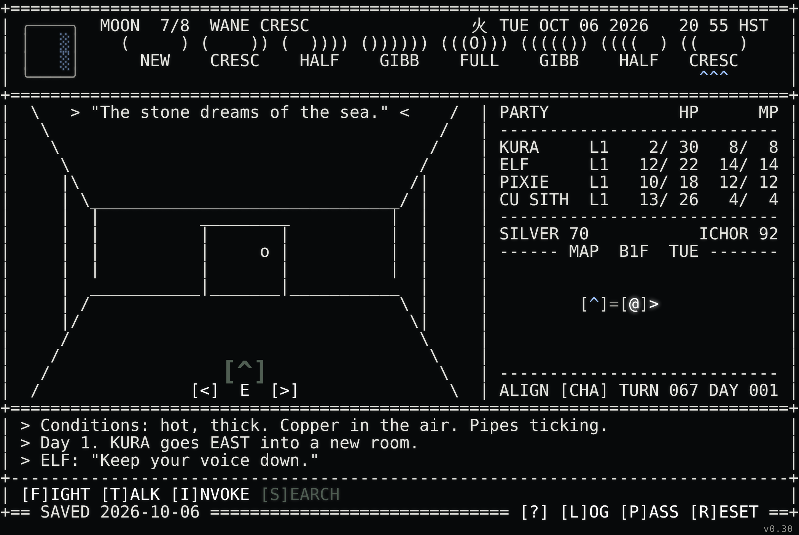

- The `[^]` step button is drawn bigger and glows, since it's the one move of the day.
- The omen on the ceiling has carets pointing in: `> "The stone dreams of the sea." <`.
- Talking to the party is much easier on them.
- **ICHOR is the party's medicine.** It sits at the top of INVOKE: Enter feeds the wounded demons. It doesn't work on KURA, who is human.
- **KURA can drink it anyway** (`[D]RINK` in INVOKE). It has consequences.
- **TRIP, the first status effect.** KURA can start to trip. The world turns strange, and coming down hurts.
- The CODEX button moved from INVOKE to the top of the LOG page (C still opens it anywhere).
- The stray `|` to the right of `[S]EARCH` on the menu bar is gone.

## v0.29 - Oct 6 2026, 20:36 HST

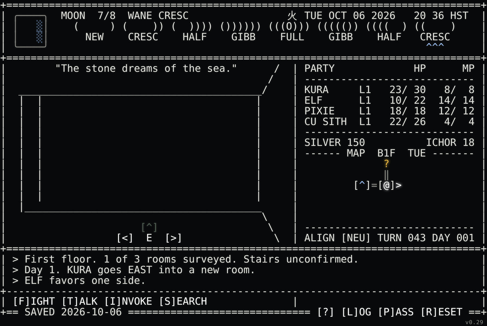

- **The omen moved to the top of the 3D view**, centered across the ceiling. A long omen wraps onto a second row, so the walls always show. The moon panel's bottom row is back to just the `^^^` marker, and the frame under the 3D view is gone, so the screen is back to its old height.
- "The moon is day 26, waning crescent." is now one of the status reports on log line 1.
- **Things are much harder to break by hand.** The party cares what you do to them.
- Searching while facing a door has a few different replies now ("KURA checks the hinges. Old, but only hinges."), never the same twice in a row.
- **Doing the same thing over and over gets noticed.** The party starts to say something.
- **The party asks questions.** Talking to a member sometimes gets a question back, with big `[Y]ES | [N]O` buttons on the right side of the log box (or press Y / N). Answers matter.
- **Demons talk before they bargain.** A demon that listens now sizes KURA up with a question or two first, each family its own way, answered `[Y]ES` / `[N]O` in the fight box. Then it asks for a gift as before.
- Data demons sometimes slip into binary (real ASCII, if you decode it): `01001000 01001001`, and one even asks a question in it.
- Fixed the right border of a log line sitting one cell short in the page font (an apostrophe, as in "Today's", wasn't exactly one cell wide). Each log line's text now sits in a box exactly 78 cells wide.

## v0.28 - Oct 6 2026, 20:03 HST

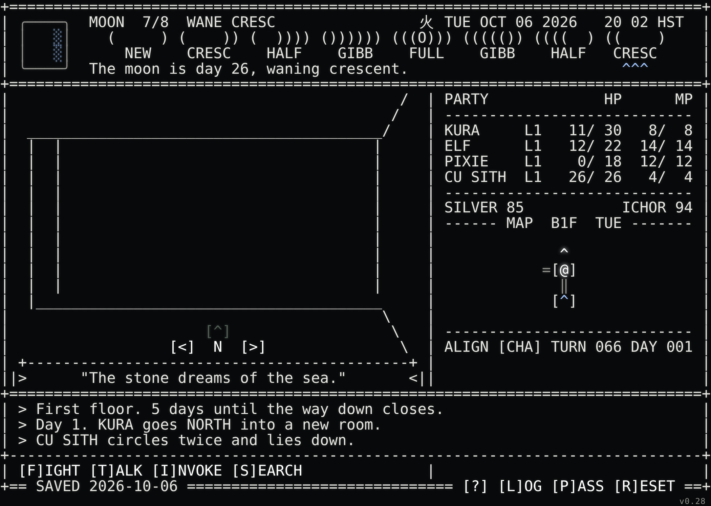

- **About page** (`[?]` in the bottom border, or the ? key): the build number, what the game is, a few numbers from this run (floor, day, turns, alignment, demons met, items found) and how full the codex is. The full stats still only show at the end of a run.
- **SEARCH is `[S]` now** (it was A). With the NSEW buttons gone, the compass keys are retired too: the day's step is `[^]` or the up arrow, and in a fight the up arrow or R runs.
- About has a guide to every key.
- **The omen has its own frame** under the 3D view: centered, with arrows on the edges that grow inward when the omen is short (`||>  "Count the doors."  <||`). It no longer sits on log line 1.
- **Log line 1 is a status report** that changes every 5-10 actions. Mostly news ("First floor. 5 days until the way down closes.", "Day 6 on this floor. The way down closes tomorrow.", "First floor. 2 of 3 rooms surveyed. Stairs unconfirmed.", "Day 3. Party wounded."), mixed with a detached conditions readout: the air, a smell, a sound or the light ("Conditions: humid. Odor of mold. Dripping, distant."). It updates right away on a new day or floor, and on the last day. A fight leaves copper in the air; a break, smoke.
- One omen reworded: "The deep remembers a name. Yours...soon."
- The build number shows small under the screen's lower right corner.
- The bottom border reads `[?] [L]OG [P]ASS [R]ESET`. BACKUP is now `[P]ASS`, the run's password like old console games (copy it to keep or move the run; paste one in to continue it), and RST is spelled out as `[R]ESET`.
- **The adventure log keeps everything you read:** each day's omen, every action, everything said and done in a fight or a talk, and line 3 whenever it changes (party replies, finds, warnings). Follow-up lines sit indented under the action they belong to. Hidden numbers stay out.
- **Items can break.** Trying to use something that does nothing can break it. The party cares what you break.
- Each changelog entry now comes with a screenshot of that build.
- The README is up to date with how the game plays now.

## v0.27 - Oct 6 2026, 19:16 HST

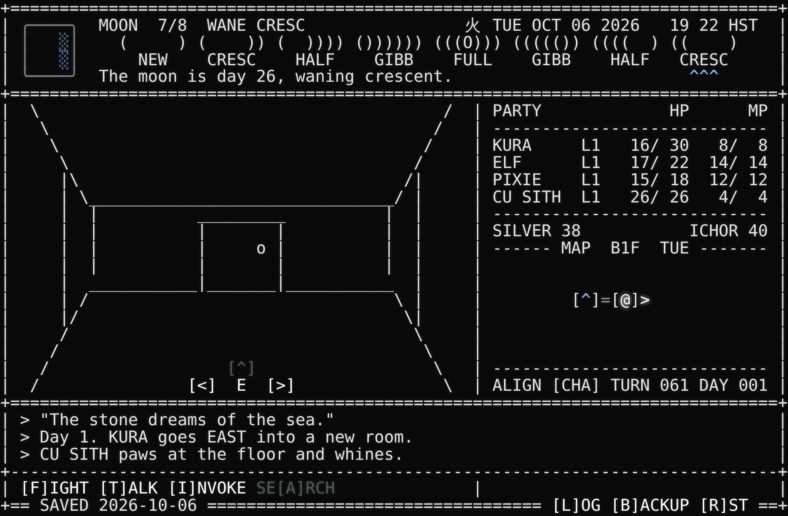

- **A block moon** sits at the far left of the top panel, showing today's phase: lit columns fill in as it waxes and empty as it wanes, and on the page the lit part glows and slowly breathes. The phase bar shifts over to make room.
- **The day's step is the `[^]` button** above the facing letter in the 3D view: it walks KURA the way she faces (dimmed when that's a wall or the step is spent). The NSEW buttons are gone from the bottom right, which is kept free for answering the party later. The N/S/E/W keys still work, and in a fight `[R]UN` handles escaping.
- `[C]ODEX` left the bottom border; it's still in INVOKE (and on the C key).
- **The end-of-run log has the whole run's stats:** floor reached, days, turns, steps, searches, demons met and recruited, items found, SILVER and ICHOR, and who was left in the party.
- On a run's first day, taking the step asks twice: "GO WEST?" and then "ARE YOU REALLY SURE? This is your only move for the day."
- The fight box has a `[R]UN` button (or R): KURA runs through the door she faces, or another open one. It's dimmed when today's step is already spent.
- When the run ends, the adventure log opens by itself (after the fight box is closed), topped with where and when it ended: "THE RUN IS OVER. B2F, day 4, turn 61."

## v0.26 - Oct 6 2026, 16:02 HST

- Trying to use an item that does nothing still counts a TURN, like any other action.
- **Runs that got ahead of the real date snap back.** A wrong device clock could push a run's calendar days ahead, and the rewind guard then locked that in. Once the page knows the real time, such a run snaps back to today once ("The calendar shudders and settles on today."), and a deadline further out than next week's Sunday is pulled in. RST always starts a run on the real calendar now.

## v0.25 - Oct 6 2026, 15:54 HST

- **The game uses the real time, not the device's.** When the page loads it asks the server for the time and goes by that, so a wrong or changed device clock can't move the game forward or back. If the server can't be reached (offline), it falls back to the device clock, still guarded against rewinding.
- **Days follow the player's own midnight.** A new run counts days in the timezone of the device that starts it: the clock, the date, the daily step and the Sunday deadlines are all local. The run keeps that timezone, so traveling mid-run can't add or skip a day. Runs started before this, and the chat run, stay on Honolulu time.
- Using an item from INVOKE shows the result on log line 2 in gold, instead of inside the INVOKE box.
- The clock shows the timezone after the time (`15:51 HST`, `EDT`, or `GMT+9` where there's no short name).

## v0.24 - Oct 6 2026, 15:42 HST

- **Talking reads the room.** When KURA talks to the party, the answer follows the mood of the place.

- **Patience.** Party members get tired of being talked to. A night's rest gives some back.

## v0.23 - Oct 6 2026, 15:31 HST

- **TALK with no demon around** talks to the party. Someone answers on line 3: PIXIE chatters, ELF is aloof, CU SITH answers without words, and recruited demons speak in their family's voice ("QUERY NOT UNDERSTOOD. RETRY?"). Now and then something that isn't the party answers instead ("A voice below counts to seven, then stops."). Alone, KURA hears only the walls, or the voice.
- INVOKE: `[ENTER] use` and `[C]ODEX` can be clicked, and what happened shows right in the box. Items with no use yet say "KURA turns the spent battery over. Nothing happens." and aren't spent.
- The minimap sits one row higher, so KURA is centered in the map box.

## v0.22 - Oct 6 2026, 15:20 HST

- **Demons ask for anything.** A demon that listens asks for a gift, and KURA picks from a list: SILVER, any item she carries, or nothing. How it reacts depends on what it gets.
- **CHAOS demons are tricksters.** They bargain differently from the rest.
- **INVOKE opens inside the 3D view** instead of over the whole screen, so the party, map and log stay visible. Pick an item with the number keys or arrows (or click it) and a box below shows what it is and what it does; Enter (or clicking it again) uses it.
- KURA starts each run with a few items, so there's something to give the first demon.
- **CODEX** (`[C]`, in the bottom border): an encyclopedia of every demon met and item found, with `[D]EMONS` and `[I]TEMS` tabs. Unknown entries show as `???`. Demon entries have the family, alignment, a line of its voice, what it wants, and how often it's been met and recruited. Item entries have a short note. The codex survives RST, so it fills up across runs.

## v0.21 - Oct 6 2026, 15:00 HST

- **Recruiting.** KURA is the only human; ELF, PIXIE and CU SITH are demons too, and any demon can join. TALK goes in steps: the demon decides whether to listen, names its price, KURA answers `[Y]ES` or `[N]O`, and once paid it may offer to join. With a full party (KURA plus 3), you choose who to send away, or keep everyone.
- **Each family speaks and bargains its own way.** Data demons talk in system messages, haunted hardware in corrupted memory, hybrids mix the two, and folklore speaks in old words.
- **Alignments.** Every demon is LAW, NEUTRAL or CHAOS. The encounter box shows how it sees KURA: "KURA is recognized.", "Undecided." or "bares its teeth."
- **KURA's alignment moves with her choices.** Nearly every choice nudges it. The ALIGN tag only flips at a threshold ("The system takes notice. [LAW]" / "The old things take notice. [CHA]") and returns to [NEU] near the middle ("KURA finds her balance.").
- **The ALIGN tag shows each action's pull.** A bracket turns into a glowing arrow for the action that just happened: `<NEU]` pulled toward LAW, `[NEU>` toward CHAOS.
- A new run now resets KURA's alignment fully.
- PIXIE, ELF and CU SITH can now also turn up as wild demons.
- Long demon names are shortened in the party panel (STATIC BANSHEE shows as S.BANSHE).
- Fixed the right border on the clock line sticking out past the rest of the frame (the weekday kanji was taking more than its two cells).

## v0.20 - Oct 6 2026, 14:35 HST

- The Japanese weekday kanji sits left of the date (`火 TUE OCT 06 2026`).
- The moon panel's marker row carries a short moon update: "The moon is day 26, waning crescent." It sits on whichever side the `^^^` marker isn't.

## v0.19 - Oct 6 2026, 14:24 HST

- The game never goes back in time: setting the device clock earlier than a day the run has already seen leaves the game on that day ("The calendar won't turn back."), so a day can't be redone and a deadline can't be dodged.
- Confirming a step is now a popup: "GO EAST? This uses today's one step." with `[ YES ]` (Enter, Y, or the same direction again) and `[ NO ]` (Esc or anything else).
- Two new good omens, alongside the existing ones.
- Omens are always in quotes. Ordinary days get mysterious lines too ("Count the doors. Then count them again."), so every day reads like an omen; they just carry no effect.

## v0.18 - Oct 6 2026, 14:13 HST

- **Daily omens** on line 1: one per real day, seeded from the date, always true.
- **Rooms stir:** searching makes noise, and line 3 hints when the room has noticed.
- **Taking the stairs down is free:** it no longer uses the day's step.
- More search misses ("Old tally marks, in groups of five.").
- The moon shows up on line 3 now and then.

- During a fight, the directions you can run through glow white, with a `RUN?` label above them; the long explanation in the fight box is gone.
- Popup boxes close with `[ OK ]` (click it, or press Enter, Space or Esc).
- The `?` is now a hidden locker.
- New demons: half old folklore (GHOUL, ONI, KAPPA, LAMIA…), half born in the city's wires (GLITCH, STATIC, CHROMEDOG, WIREWRAITH, NEON ONI, DATAGHOUL, RUST KAPPA, BLACK ICE).

## v0.17 - Oct 6 2026, 11:06 HST

- SE[A]RCH moved to the free actions on the left, since it can be used any number of times.
- The day's step buttons are spelled out: `[N]ORTH [S]OUTH [E]AST [W]EST`.
- When a search turns something up, a gold-bordered box says what KURA found (with its note) and waits for Enter, Space, Esc or a click. Holding A won't skip past it.
- Real encounters. A demon that turns up (in a wall, or wandering in) stays until it's dealt with, in a box showing its name and HP bar. Each round, choose:
  - `[F]IGHT`: everyone still standing strikes, then the demon strikes back. Beat it for ICHOR.
  - `[T]ALK`: it may listen and leave (sometimes with a gift), ask for SILVER, or laugh and refuse to talk again.
  - Run through a door: during a fight the open directions in the menu glow red. Stepping through one uses the day's step either way; with the step already spent, there's no running.
- If KURA falls, the run is over. Using an item mid-fight is free.
- Moving takes two presses: the first lights the button gold and asks "Use today's step to go NORTH? Press [N] again.", the second moves. Anything else, or six seconds, cancels.

## v0.16 - Oct 6 2026, 10:48 HST

- `[I]NVOKE` (or I) opens the inventory: every item KURA carries, with counts and a short note. Press a number or click to use one; using an item is free.
- 20 more common finds, old-dungeon things (a rusted iron key, a jar of grave salt) and ruined-city tech (a dead pager, a cracked phone, a neon tube fragment, a VR visor). Just for keeping, each with a short note.
- Usable for now: a vial of medicine, a strip of prayer cloth, a stub of black candle. Keepsakes and rares can be looked at but not used yet.

## v0.15 - Oct 6 2026, 10:31 HST

- Demons can kill. Every demon fight (hidden or wandering) can drop party members to 0 HP, and if KURA falls, the run is over. A night's rest heals everyone a little.
- SEARCH works on the wall KURA faces. Each wall has its own hidden things, so turn to try another wall. Doors can't be searched, and SE[A]RCH dims while facing one.
- The look controls are spaced out: `[<]  W  [>]`.
- Party rows give names one more column and fit three-digit HP and MP (`KURA     L99 999/999 450/999`).
- The adventure log records every action now: steps, every search (empty ones too), turns, walls and new days, each tagged with its day and turn (`D005 T012  KURA turns to face NORTH. Bare stone.`). It keeps the last 20,000 entries; a BACKUP code carries the last 300.
- Turning now says what KURA sees on line 2: "KURA turns to face WEST. A warped door in its frame." Only what the 3D view already shows (wall, door, or found stairs), in a few different words each.

## v0.14 - Oct 6 2026, 10:17 HST

- Search lines no longer show a try count ("KURA searches. Nothing.").
- The third line drifts: besides changing with each step and new day, it has a chance to change after any search or turn, so it isn't frozen all day.
- The third line has more to say: party chatter ("PIXIE hums an old song, off key."), how hurt members are holding up ("CU SITH is breathing hard."), demon sounds, and ambient sounds. Faint clues still turn up now and then.
- The controls under the 3D view only look around now: `[<]` and `[>]` (and the left/right arrow keys) turn KURA, and `[^]` is gone. Moving is only `[N] [S] [E] [W]`.
- The minimap shows which way KURA faces with an arrow beside her room: `[@]>` east, `<[@]` west, `^` above for north, `v` below for south. It covers the door mark on that side.

## v0.13 - Oct 6 2026, 10:00 HST

- Anyone can play on the page: each player's run is saved in their own browser and saves itself after every action. A first visit starts a fresh run. No accounts or tokens.
- `[L]OG` shows the run's adventure log, newest first: every step, find, new day and descent. Empty searches are left out.
- `[B]ACKUP` shows the run as a save code to copy. Pasting a code restores that run, for backups or moving to another device.
- `[R]ST` asks before ending a run. LOAD is gone; the repo's `save.json` is now only the chat run (`/smt-screen`).

## v0.12 - Oct 6 2026, 10:00 HST

- Days follow the real calendar (Honolulu time). The day's step comes back at midnight, DAY counts real days since the run began, and the map header shows today's real weekday.
- Each floor's way down closes at the end of a Sunday. A new run's first floor closes this Sunday (or next Sunday if fewer than 3 days are left). Taking the stairs early gives the next floor extra days: it closes the Sunday after next.
- On the last day, the third line warns that the way down closes tonight. Miss the deadline and the run is over.
- NE[X]T is gone from the screen.

## v0.11 - Oct 6 2026, 09:48 HST

- One step per day. `[N] [S] [E] [W]` take the day's step through the door on that side (or down the stairs once found), and dim once used. Turning and the free actions are unlimited.
- Searching is unlimited, but a search only sometimes turns up something, and an empty room never answers. The log counts the tries ("KURA searches (12). Nothing.").
- New bottom menu: free actions on the left (`[F]IGHT [T]ALK [I]NVOKE`, not built yet; INVOKE replaces SUMMON), daily actions on the right after a divider. ITEM, MAGIC, COMP, EQUIP and GO are gone; `[^]` under the 3D view still steps forward.
- The map header shows the floor's weekday, MON to SUN (`MAP  B3F  WED`). SUN is the last day to find the stairs. For now it follows the floor's day count; later a floor will start on a real Monday.
- STEP on the bottom line is renamed TURN, to match DAY. It still counts every action: steps, searches and turning.
- Keys: N S E W step, A search, arrows turn and step forward, L load, R reset.

## v0.10 - Oct 6 2026, 09:25 HST

- New minimap symbols, one per room: `[@]` KURA, `[^]` the way up, `[v]` the stairs down once found, `[?]` the lure, `[ ]` a visited room. Doors are `=` between rooms side by side and `‖` between stacked rooms. The facing direction lives in the turn controls and FACE instead of the map.
- The saved game's map is redrawn in the new style.
- `[^]` (GO) into a wall now stops with a message like "KURA walks into solid stone." No day is spent, and KURA no longer spins to the next door.
- The end of the week is now deadly: if the stairs aren't taken by the 7th day on a floor, the next action ends the run. The party falls to 0 HP, the view goes dark, and only RST starts over. (This replaces the old placeholder that dropped KURA to the next floor.)
- The three log lines each have one job. Line 1 (moon and demons) changes once per real day. Line 2 describes KURA's latest action: moving, searching, turning, walking into a wall. Line 3 is flavor, with the occasional faint clue, and changes when a day passes.
- FACE on the bottom line is replaced by STEP, a count of every action KURA has taken: GO, SEARCH and turning (`STEP 012`). Bumping a wall doesn't count.

## v0.9 - Oct 6 2026, 09:15 HST

- Turn controls at the foot of the 3D view: `[^]` walks forward, `[<]` and `[>]` turn, and the letter between them shows which way KURA faces. Click them or use the arrow keys.
- Turning writes "KURA turns to face EAST." (free, no day spent), so direction words show up in actions as well as movement.
- The "[L]OAD returns to the saved game" note under the screen is gone.
- The first log line is now a mysterious word on the moon, the demons or both ("Demons drowse in the corners.", "The moon is a white eye, wide open."), with no phase number since the moon bar shows it. Five versions per phase, changing with each new day.

## v0.8 - Oct 6 2026, 08:16 HST

- The save status moved into the bottom border (`SAVED 2026-10-06` or a gold `NOT SAVED`), so all three log lines are free for the game.
- Log lines only name a direction when stating a character's action, such as "KURA goes WEST into a new room". Doors and hints never give a direction away; the map, the room view and FACE show where things are.
- Doors are only counted when KURA first searches a room ("A single door." / "Two doors.").
- Turning no longer writes a log line. After GO or SEARCH, the third line is atmosphere. It sometimes carries a faint clue about the room or the door KURA faces (a hollow floor, a cold draft, a glint), never a direction.
- The save status shows for a few seconds after loading or playing, then fades back into the border.
- The clock's colon blinks more slowly.

## v0.7 - Oct 6 2026, 08:02 HST

- The clock is live: the colon blinks every second and the time changes the moment the minute turns over.
- The minimap is centered on KURA: her room stays in the middle and the floor moves around her.
- The README links to the playable page.

## v0.6 - Oct 6 2026, 07:53 HST

- The game now plays on real floors. The minimap, the room view and the second log line all follow KURA.
- `[G]O` (or the up arrow) walks through the door KURA faces, or down the stairs once they're found. Facing a wall, GO turns to the next way out instead. The left and right arrows turn KURA. Turning is free.
- `SE[A]RCH` (or A) turns up what the room hides. A room with nothing left can't be searched.
- GO and SEARCH each use up a day. NEXT picks a day's action by itself, as a testing shortcut.
- If the week runs out without finding the stairs, the floor gives way and KURA falls to the next floor (a placeholder rule).
- RST starts a new run on a fresh B1F.
- MAG is now ICHOR.

## v0.5 - Oct 6 2026, 07:43 HST

- Floor generation in the new `floor.js`. Each floor is 3 rooms in a 3x3 grid, joined by doors in a line or an L. KURA starts in the up-stairs room.
- The stairs down are hidden in one of the other rooms. Searching turns hidden things up one at a time.
- Some floors have a `?`: a shop, special room or rare item, shown in the dark until it's found.
- New minimap for floors: only rooms KURA has been in are drawn, as `[   ]`, with doors `╫` (side by side) and `═` (stacked). Floors aren't wired into NEXT or the save yet.
- MACCA is now SILVER.

## v0.4 - Oct 6 2026, 06:57 HST

- `[N]EXT`, `[L]OAD` and `[R]ST` buttons in the bottom border of the page. Click them or press N, L or R.
- NEXT rerolls a placeholder room (random map, room view, HP/MP, MACCA, MAG) and RST starts a new run. Both happen only in your browser and are never saved; a `NOT SAVED` note shows until you LOAD.
- LOAD reloads the saved game from GitHub.
- Random rolls live in the new `rules.js`.

## v0.3 - Oct 6 2026, 06:42 HST

- New fog-of-war minimap: visited rooms are `□`, unexplored rooms stay hidden, and a lone gold `?` waits in the dark (a lure, not the exit).
- Stairs: `⋰↑` up, `↓⋱` down.
- Text is soft white instead of green-tinted, KURA's arrow is pure white, and the screen is slightly bigger on computers.
- Map symbols are boxed to exactly one character so the right border stays straight in any font; plain characters like `?` and the arrow use the retro screen font.

## v0.2 - Oct 6 2026, 05:59 HST

- MACCA and MAG share one line; the party panel uses the full width.
- KURA is drawn on the minimap as an arrow showing the facing direction (`^ > v <`), and the bottom line reads `ALIGN [NEU]  FACE E  DAY 004`.
- The page refreshes once a minute and picks up new saves without reloading.

## v0.1 - Oct 6 2026, 05:43 HST

- First screen on the web: an 80-column Shin Megami Tensei-style dungeon screen drawn from `save.json`, with the live Honolulu date, time and moon phase.
- The same drawing code (`screen.js`) is used by the web page, the `/smt-screen` chat command and the morning screen.
