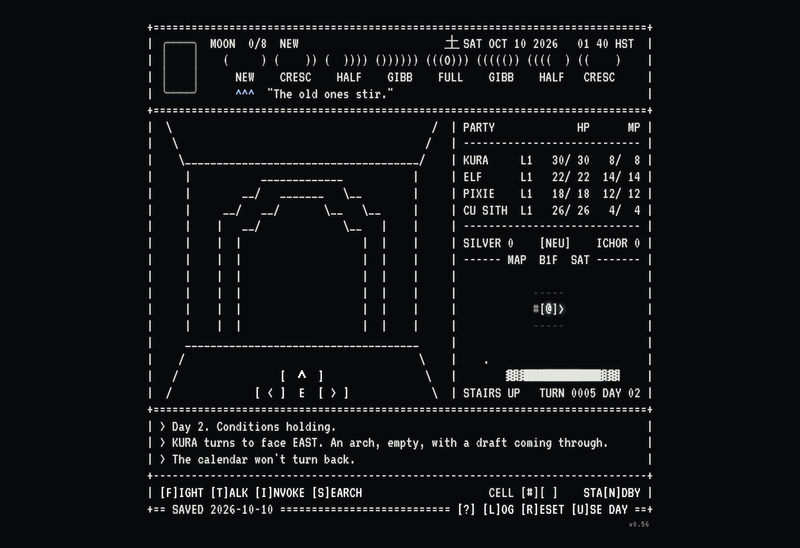

# Daily Digital Demon Dungeon

**Play it here: https://okayline.github.io/daily-dungeon/**

An 80-column ASCII roguelike dungeon crawler in the spirit of 80s CRPGs and Shin Megami Tensei, played one step a day on the real calendar. The real moon phase impacts gameplay in different ways.

## How it plays

- **One step a day.** Press `[^]`. Then wait for tomorrow.
- **Search all you like.** The walls hide things. Something else may notice.
- **Demons don't leave.** Fight them, talk to them, or run. Some want gifts. Some want to join you. Some are lying.
- **Your party has opinions.** Talk to them. Don't push your luck.
- **Every choice leans you.** LAW, NEUTRAL or CHAOS. The demons can tell.
- **The moon is real. So is the omen.** One omen a day, the same for everyone. Three LAW-leaning days or three CHAOS-leaning days in a row and something changes.
- **STANDBY can bank a day.** Hold instead of stepping and that day's omen is kept, to spend later instead of whatever the day brings.
- **Everyone's exploring the same dungeon.** Each floor's shape is shared with every other player this lunar month. What's actually behind each door is yours alone.
- **Each floor is a week.** The way down closes Sunday night. Miss it and the run is over.
- **Don't drink the ichor.** Or do.

Your run saves itself in your browser. Finish a run and you can post it to the leaderboard. `[?]` explains the keys and holds the password (to move a run to another device) and the leaderboard. `[L]OG` keeps the story.

## Files

- `index.html` is the page: buttons, keys, popups, the in-browser save, and the `[?]` menu (password, codex, leaderboard).
- `screen.js` draws the 80-column screen and keeps the time. Every line is checked to be exactly 80 characters.
- `floor.js` rolls each floor: four wings, each a small cluster of spaces joined by doors, built lazily as you unlock them, with the stairs hidden behind a wall somewhere in the last one. A floor's shape is shared with every player this lunar month; what's actually behind each door is rolled privately, per account.
- `rules.js` holds the rules.
- `leaderboard/` is the Cloudflare Worker + D1 leaderboard the page posts finished runs to — see its own README to set one up.
- `CHANGELOG.md` lists every update with its time and a screenshot.
- `screenshots/` holds a screenshot of each build (the page itself uses the VT323 font).
- `fonts/` holds the VT323 font the page uses, with its license (SIL Open Font License).
- `archive/` keeps retired pieces of the project, for history.
- `save.json` was the save file for the retired `/smt-screen` chat front end (see `archive/`); the page doesn't use it.
