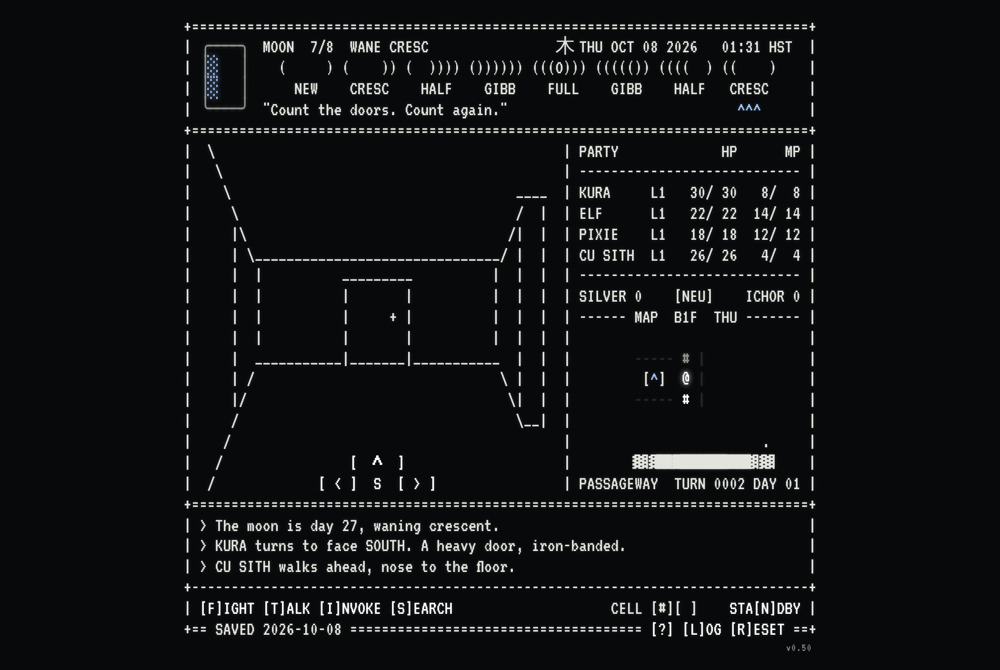

# Daily Digital Demon Dungeon

**Play it here: https://okayline.github.io/daily-dungeon/**

An 80-column ASCII roguelike dungeon crawler in the spirit of 80s CRPGs and Shin Megami Tensei, played one step a day on the real calendar. The real moon phase impacts gameplay in different ways.

## How it plays

- **One step a day.** Press `[^]`. Then wait for tomorrow.
- **Search all you like.** The walls hide things. Something else may notice.
- **Demons don't leave.** Fight them, talk to them, or run. Some want gifts. Some want to join you. Some are lying.
- **Your party has opinions.** Talk to them. Don't push your luck.
- **Every choice leans you.** LAW, NEUTRAL or CHAOS. The demons can tell.
- **The moon is real.** So are the omens.
- **Each floor is a week.** The way down closes Sunday night. Miss it and the run is over.
- **Don't drink the ichor.** Or do.

Your run saves itself in your browser. `[?]` explains the keys, `[L]OG` keeps the story, `[P]ASS` moves your run to another device.

## Files

- `index.html` is the page: buttons, keys, popups and the in-browser save.
- `screen.js` draws the 80-column screen and keeps the time. Every line is checked to be exactly 80 characters.
- `floor.js` rolls each floor: 3 rooms in a 3x3 grid, joined by doors, with the stairs hidden behind a wall.
- `rules.js` holds the rules.
- `save.json` is the chat version's run (`/smt-screen`). The page doesn't use it.
- `CHANGELOG.md` lists every update with its time and a screenshot.
- `screenshots/` holds a screenshot of each build (the page itself uses the VT323 font).
- `fonts/` holds the VT323 font the page uses, with its license (SIL Open Font License).
